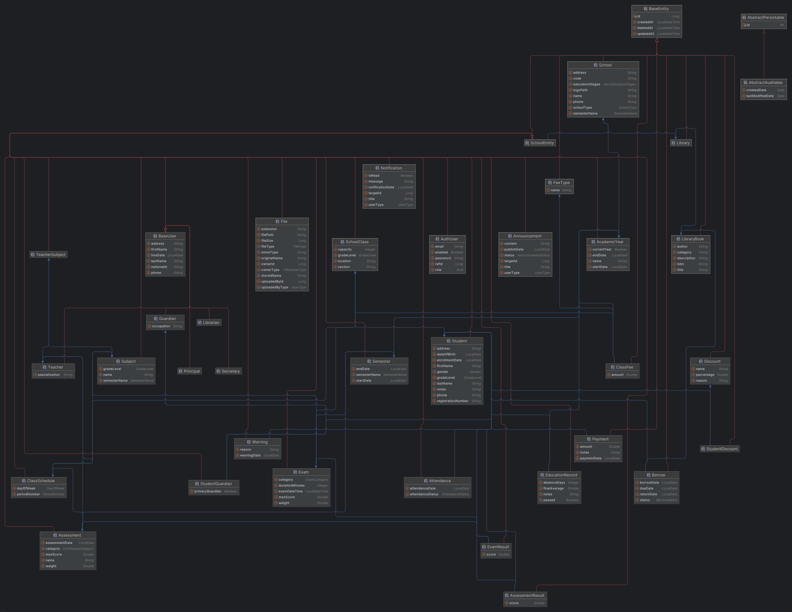

# School Management System

A scalable **School Management System** built using **Spring Boot Microservices Architecture**.

The system is designed to support multiple schools using **Multi-Tenant Architecture** with a shared database and tenant isolation.

---

## Architecture

The project follows a **Microservices Architecture** pattern:

```
                    +----------------+
                    |     Client     |
                    +-------+--------+
                            |
                            |
                    +-------v--------+
                    |   API Gateway  |
                    |   Port: 8080   |
                    +-------+--------+
                            |
             +--------------+-------------+
             |                            |
    +-------v--------+            +-------v--------+
    | School Service |            | Other Services |
    | Port: 8081     |            | Future         |
    +-------+--------+            +----------------+
            |
    +-------v--------+
    |  PostgreSQL    |
    +----------------+

                   +-------v--------+
                   | Eureka Server  |
                   | Port: 8761     |
                   +----------------+
```

---

## Technologies

### Backend

- Java 17
- Spring Boot
- Spring Security
- JWT Authentication
- Spring Data JPA
- Hibernate
- PostgreSQL

### Microservices

- Spring Cloud Gateway
- Eureka Discovery Server

### Infrastructure

- Docker
- Docker Compose

---

## Project Structure

```
SchoolManagementSystem/
│
├── school-service/
│   ├── src/
│   ├── pom.xml
│   └── Dockerfile
│
├── gateway/
│   ├── src/
│   ├── pom.xml
│   └── Dockerfile
│
├── eureka-server/
│   ├── src/
│   ├── pom.xml
│   └── Dockerfile
│
├── docker-compose.yml
├── .env
└── README.md
```

---

## Services

### Eureka Server

Service discovery server responsible for registering and locating microservices.

**Port:** `8761`

**Dashboard:** [http://localhost:8761](http://localhost:8761)

---

### API Gateway

The single entry point for all client requests.

**Port:** `8080`

#### Responsibilities

- Routing requests
- Service discovery through Eureka
- JWT validation
- Forwarding authenticated user information
- Protecting internal services

#### Authentication Flow

```
Client
  │
  │ (JWT Token)
  ↓
API Gateway
  │
  ├─ Validate JWT
  ├─ Extract user information
  │
  │ (Headers)
  ↓
School Service
```

#### Forwarded Headers

- `X-USER-ID`
- `X-ROLE`
- `X-SCHOOL-ID`
- `X-GATEWAY`

---

### School Service

Main business service for school operations.

**Port:** `8081`

#### Responsibilities

- Authentication
- Schools management
- Users management
- Students
- Teachers
- Guardians
- Classes
- Attendance
- Assessments

---

## Multi-Tenant Architecture

The system supports multiple schools using:

**Single Database + Tenant Isolation**

### Isolated Data per School

- Users
- Students
- Teachers
- Classes
- Academic data

### Tenant Information

The JWT token contains tenant information:
- `schoolId`
- `schoolCode`

After validation, the Gateway forwards:
- `X-SCHOOL-ID`

The School Service uses this value to isolate data between schools.

### API Endpoints Example

```
/api/{schoolCode}/auth/login
```

**Example:**

```
POST /api/alnoor-school/auth/login
```


---

## Authentication

Authentication is implemented using:

- JWT (JSON Web Tokens)
- Spring Security
- Role-Based Access Control (RBAC)

### Supported Roles

- PRINCIPAL
- TEACHER
- STUDENT
- GUARDIAN
- SECRETARY
- LIBRARIAN


---

## Security Flow

### Login Process

#### Step 1: Client sends login request

```
POST /api/{schoolCode}/auth/login
```

**Example:**

```
POST /api/alnoor-school/auth/login
```

#### Step 2: Request Body

```json
{
  "email": "admin@school.com",
  "password": "password"
}
```

#### Step 3: School Service validates

- Email
- Password
- School

#### Step 4: JWT Token is generated

```json
{
  "refId": 1,
  "role": "PRINCIPAL",
  "schoolId": 10,
  "schoolCode": "alnoor-school"
}
```

#### Step 5: Client sends token with requests

```
Authorization: Bearer JWT_TOKEN
```

#### Step 6: Gateway processes

- Validates JWT signature
- Extracts user information
- Adds internal headers
- Sends request to the required service
---

## Environment Configuration

### Local Development

Create a `.env` file in the root directory:

```env
DB_URL=jdbc:postgresql://localhost:5432/school_management_system
DB_USERNAME=postgres
DB_PASSWORD=password

JWT_SECRET=your-secret-key

GATEWAY_SECRET=your-gateway-secret

STORAGE_LOCATION=uploads
```

### Docker Environment

Inside Docker network:

```env
DB_URL=jdbc:postgresql://postgres-db:5432/school_management_system
DB_USERNAME=postgres
DB_PASSWORD=password

JWT_SECRET=your-secret-key

STORAGE_LOCATION=uploads
```

---

## Docker Services

| Service | Port |
|---------|------|
| Eureka Server | 8761 |
| API Gateway | 8080 |
| School Service | 8081 |
| PostgreSQL | 5432 |
---

## Getting Started

### Running With Docker

**Build and start all services:**

```bash
docker compose up --build
```

**Run in background:**

```bash
docker compose up -d
```

**Stop services:**

```bash
docker compose down
```

### Local Development

#### Run Eureka Server

```bash
cd eureka-server
mvn spring-boot:run
```

#### Run API Gateway

```bash
cd gateway
mvn spring-boot:run
```

#### Run School Service

```bash
cd school-service
mvn spring-boot:run
```

---

## API Examples

### Login Endpoint

**Endpoint:**

```
POST /api/{schoolCode}/auth/login
```

**Example:**

```
POST /api/alnoor-school/auth/login
```

**Response:**

```json
{
  "token": "jwt-token",
  "role": "PRINCIPAL",
  "refId": 1,
  "schoolId": 10
}
```
---

## Database

### Current Database

- **Type:** PostgreSQL
- **Hibernate Configuration:**

```properties
spring.jpa.hibernate.ddl-auto=update
```

---

## Future Improvements

### Planned Microservices

- Library Service
- Notification Service
- Payment Service
- File Storage Service
- Chat Service
- Reporting Service
- Admin Dashboard
- Monitoring with Spring Actuator
- CI/CD Pipeline

---

## Built With

- **Spring Boot** - Framework
- **Spring Cloud** - Microservices
- **Docker** - Containerization
- **PostgreSQL** - Database
- **JWT** - Security

---

**Last Updated:** August 15, 2026
